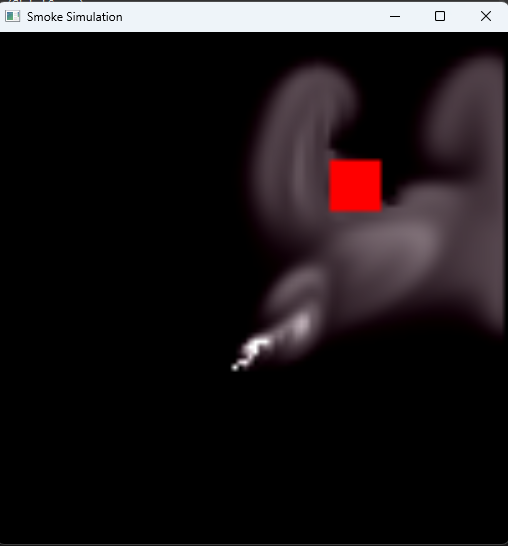
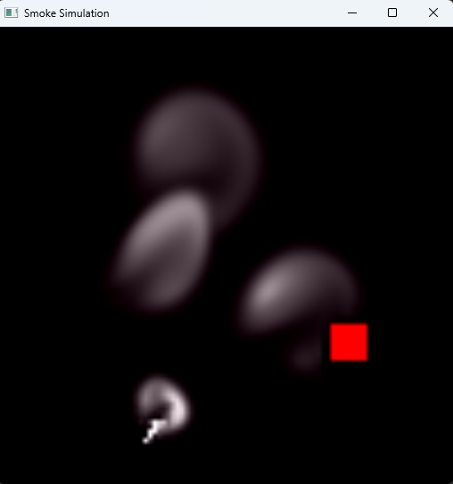
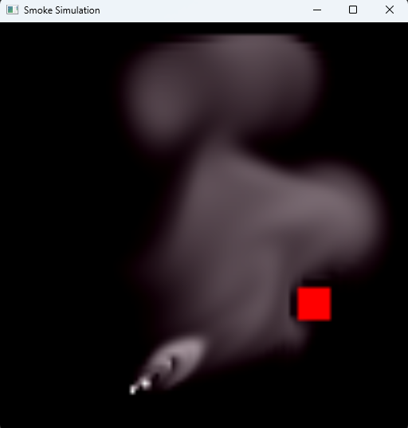
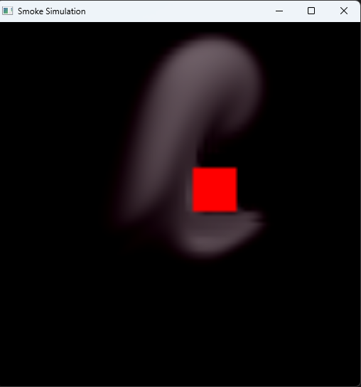

## Smoke Simulation

Real-time simulation using Navier-Stokes equation implemented in OpenGL (C++)

### Visuals

  
  

  
  

### How to Build and Run

Step #1: Clone this repo  

Step #2: Open the solution `opengl.sln` in [Visual Studio](https://visualstudio.microsoft.com).

Step #3: Click `Play` button on the menu bar  

### Features

* Clicking anywhere on the screen will start the simulation
* Press `r` to reset the screen
* Press `n` to change location of the object

### Technical Report

* https://bhautiksojitra.github.io/posts/smoke-simulation/

### References

* `main.cpp`, `common.h`, `Makefile`, `Makefile.linux` are provided in the Computer Graphics 2 course in the University of Manitoba.
